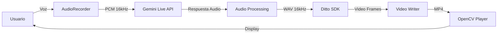
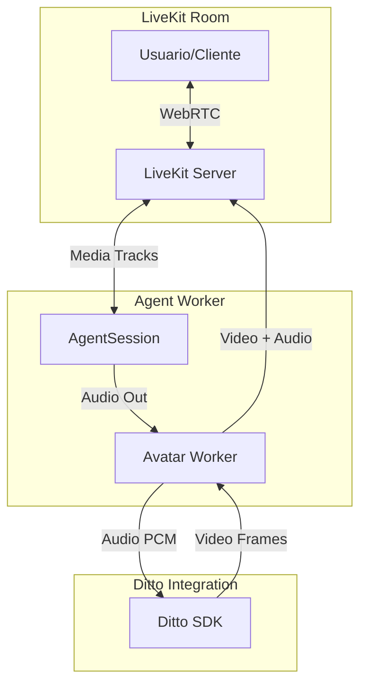

# Análisis: Características para Crear un Avatar Virtual con LiveKit

## 📋 Resumen Ejecutivo

Este documento analiza el proyecto **Ditto TalkingHead** e identifica las características clave necesarias para crear un **Avatar Virtual** utilizando **LiveKit Agents Framework**. El proyecto actual utiliza el modelo Ditto para síntesis de cabezas parlantes en tiempo real, integrado con Gemini AI, pero **no está utilizando LiveKit** actualmente.

---

## 🎯 Proyecto Actual: Ditto TalkingHead

### Descripción General
- **Modelo**: Ditto - Motion-Space Diffusion for Controllable Realtime Talking Head Synthesis
- **Versión**: 0.4.0
- **Tecnología**: PyTorch + TensorRT para inferencia optimizada
- **Python**: 3.10
- **GPU**: Optimizado para NVIDIA A100 (CUDA 12.1+)

### Arquitectura Actual



### Componentes Principales

#### 1. **Pipeline de Audio** (`gemini_realtime.py`)
- `GeminiLiveClient`: Cliente para conversaciones en tiempo real con Gemini
- `AudioRecorder`: Captura de audio del micrófono (16kHz, mono, PCM16)
- `AudioPlayer`: Reproducción de audio (24kHz)
- Funciones de resampling y conversión WAV

#### 2. **Pipeline de Video** (`stream_pipeline_online.py`, `stream_pipeline_offline.py`)
- `StreamSDK`: SDK principal para generación de video
- **Workers en paralelo**:
  - `audio2motion_worker`: Convierte audio a movimientos faciales
  - `motion_stitch_worker`: Combina movimientos
  - `warp_f3d_worker`: Deformación 3D
  - `decode_f3d_worker`: Decodificación de frames
  - `writer_worker`: Escritura de video

#### 3. **Modelos Core** (`core/models/`)
- `appearance_extractor`: Extrae características de apariencia
- `motion_extractor`: Extrae características de movimiento
- `lmdm`: Latent Motion Diffusion Model
- `decoder`: Decodifica frames finales
- `stitch_network`: Red de costura
- `warp_network`: Red de deformación

#### 4. **Sesión en Tiempo Real** (`realtime_avatar.py`)
```python
class RealtimeAvatarSession:
    - Integra Gemini AI + Ditto
    - Graba audio del usuario
    - Procesa con Gemini
    - Genera video con Ditto
    - Reproduce sincronizado
```

---

## 🚀 Características Necesarias para Avatar Virtual con LiveKit

### 1. **Arquitectura LiveKit Agents**

Según la documentación de LiveKit, la arquitectura recomendada es:



### 2. **Componentes Clave de LiveKit**

#### A. **AgentSession** (Núcleo del Agente)
```python
from livekit.agents.voice import AgentSession, Agent

session = AgentSession(
    llm=openai.realtime.RealtimeModel(),  # o Gemini
    vad=silero.VAD.load(),
    stt=deepgram.STT(),  # Speech-to-Text
    tts=elevenlabs.TTS()  # Text-to-Speech
)
```

**Características**:
- Maneja el ciclo de vida del agente
- Gestiona VAD (Voice Activity Detection)
- Coordina STT, LLM, TTS
- Publica/suscribe tracks de audio/video

#### B. **AvatarSession** (Worker de Avatar)
```python
from livekit.plugins import hedra, simli, tavus

avatar_session = hedra.AvatarSession(
    avatar_participant_identity="ditto-avatar",
    avatar_image=Image.open("avatar.png"),
)

await avatar_session.start(session, room=ctx.room)
```

**Características**:
- Crea un **participante separado** en la sala
- Recibe audio del `AgentSession`
- Genera video sincronizado
- Publica tracks de video + audio a la sala

#### C. **Plugin Personalizado para Ditto**

Necesitas crear un plugin similar a los existentes (Hedra, Simli, Tavus):

```python
# livekit-plugins-ditto/livekit/plugins/ditto/avatar.py

from livekit.agents import Plugin
from livekit.plugins.ditto import DittoAvatarSession

class DittoPlugin(Plugin):
    def __init__(self):
        super().__init__()
        
class DittoAvatarSession:
    def __init__(
        self,
        avatar_participant_identity: str,
        source_image: str,
        data_root: str = "./checkpoints/ditto_pytorch",
        cfg_pkl: str = "./checkpoints/ditto_cfg/v0.4_hubert_cfg_pytorch.pkl",
    ):
        self.sdk = StreamSDK(cfg_pkl, data_root)
        # ... inicialización
        
    async def start(self, agent_session, room):
        # Crear participante de avatar
        # Suscribirse al audio del agente
        # Generar frames de video
        # Publicar video track
        pass
```

### 3. **Integración de Audio en Tiempo Real**

#### Flujo de Audio Actual vs LiveKit

**Actual (Gemini + Ditto)**:
```
Usuario → Micrófono → Gemini API → Audio Response → Ditto → Video
```

**Con LiveKit**:
```
Usuario → WebRTC → LiveKit Room → AgentSession → Avatar Worker → Video Track
                                      ↓
                                    LLM (Gemini/OpenAI)
                                      ↓
                                    TTS → Audio
```

#### Implementación Requerida

```python
class DittoAvatarWorker:
    async def _audio_stream_handler(self):
        """Procesa audio del agente en tiempo real"""
        async for audio_frame in self.agent_audio_stream:
            # Convertir LiveKit AudioFrame a formato Ditto
            audio_data = self._convert_audio_frame(audio_frame)
            
            # Procesar con Ditto SDK
            video_frame = await self._generate_video_frame(audio_data)
            
            # Publicar video frame a LiveKit
            await self._publish_video_frame(video_frame)
```

### 4. **Gestión de Video Frames**

#### Características de Video LiveKit

```python
from livekit import rtc

# Crear video source
video_source = rtc.VideoSource(
    width=512,
    height=512,
    fps=25  # Ditto genera a 25 fps
)

# Publicar track
video_track = rtc.LocalVideoTrack.create_video_track(
    "ditto-avatar-video",
    video_source
)

await room.local_participant.publish_track(video_track)
```

#### Pipeline de Frames

```python
async def _video_generation_loop(self):
    """Loop principal de generación de video"""
    while self.is_running:
        # Obtener audio chunk del agente
        audio_chunk = await self.audio_queue.get()
        
        # Generar frames con Ditto
        frames = self.sdk.run_chunk(audio_chunk)
        
        # Publicar cada frame
        for frame in frames:
            # Convertir numpy array a VideoFrame
            video_frame = rtc.VideoFrame(
                width=512,
                height=512,
                type=rtc.VideoBufferType.RGBA,
                data=frame.tobytes()
            )
            
            # Capturar frame al video source
            await self.video_source.capture_frame(video_frame)
```

### 5. **Sincronización Audio-Video**

> [!IMPORTANT]
> La sincronización es crítica para la experiencia del usuario

#### Estrategias de Sincronización

**A. Buffer de Audio**
```python
class AudioVideoSync:
    def __init__(self, buffer_ms=100):
        self.audio_buffer = queue.Queue()
        self.video_buffer = queue.Queue()
        self.buffer_duration = buffer_ms
        
    async def sync_streams(self):
        """Sincroniza audio y video con buffer"""
        while True:
            # Esperar a tener suficiente buffer
            if self.audio_buffer.qsize() >= self.min_buffer_size:
                audio = self.audio_buffer.get()
                video = await self.generate_video(audio)
                await self.publish_synced(audio, video)
```

**B. Timestamps**
```python
# Usar timestamps de LiveKit para sincronización
audio_frame.timestamp_us  # Microsegundos
video_frame.timestamp_us  # Debe coincidir con audio
```

### 6. **VAD (Voice Activity Detection)**

```python
from livekit.plugins import silero

# Configurar VAD para detectar cuando el usuario habla
vad = silero.VAD.load(
    min_speech_duration=0.1,  # 100ms mínimo
    min_silence_duration=0.5,  # 500ms para considerar fin
)

session = AgentSession(
    vad=vad,
    # ... otros componentes
)
```

**Integración con Avatar**:
- Cuando VAD detecta silencio del usuario → Agente puede hablar
- Durante habla del agente → Avatar se anima
- Durante silencio → Avatar en estado idle

### 7. **Gestión de Estado del Avatar**

```python
class AvatarState(Enum):
    IDLE = "idle"           # Avatar en reposo
    LISTENING = "listening" # Usuario hablando
    THINKING = "thinking"   # Procesando respuesta
    SPEAKING = "speaking"   # Avatar hablando

class DittoAvatarSession:
    def __init__(self):
        self.state = AvatarState.IDLE
        
    async def on_user_speech_start(self):
        self.state = AvatarState.LISTENING
        # Mostrar animación de escucha
        
    async def on_agent_speech_start(self):
        self.state = AvatarState.SPEAKING
        # Iniciar generación de video
```

---

## 🔧 Implementación Propuesta

### Estructura del Plugin

```
livekit-plugins-ditto/
├── livekit/
│   └── plugins/
│       └── ditto/
│           ├── __init__.py
│           ├── avatar.py          # AvatarSession principal
│           ├── video_source.py    # Gestión de video source
│           ├── audio_processor.py # Procesamiento de audio
│           └── ditto_sdk.py       # Wrapper del SDK Ditto
├── pyproject.toml
└── README.md
```

### Código Base del Plugin

```python
# livekit/plugins/ditto/avatar.py

from livekit import rtc
from livekit.agents import Plugin, utils
from typing import Optional
import asyncio
import numpy as np

class DittoAvatarSession:
    def __init__(
        self,
        avatar_participant_identity: str = "ditto-avatar",
        source_image: str = None,
        data_root: str = "./checkpoints/ditto_pytorch",
        cfg_pkl: str = "./checkpoints/ditto_cfg/v0.4_hubert_cfg_pytorch.pkl",
    ):
        self._identity = avatar_participant_identity
        self._source_image = source_image
        self._data_root = data_root
        self._cfg_pkl = cfg_pkl
        
        # Inicializar Ditto SDK
        from stream_pipeline_online import StreamSDK
        self._sdk = StreamSDK(cfg_pkl, data_root)
        
        # Estado
        self._room: Optional[rtc.Room] = None
        self._video_source: Optional[rtc.VideoSource] = None
        self._audio_stream: Optional[rtc.AudioStream] = None
        self._tasks: list[asyncio.Task] = []
        
    async def start(self, agent_session, room: rtc.Room):
        """Inicia la sesión de avatar"""
        self._room = room
        
        # Crear video source
        self._video_source = rtc.VideoSource(
            width=512,
            height=512,
            fps=25
        )
        
        # Publicar video track
        video_track = rtc.LocalVideoTrack.create_video_track(
            f"{self._identity}-video",
            self._video_source
        )
        
        await room.local_participant.publish_track(
            video_track,
            rtc.TrackPublishOptions(
                source=rtc.TrackSource.SOURCE_CAMERA
            )
        )
        
        # Setup Ditto con imagen fuente
        output_path = f"./tmp/{self._identity}_output.mp4"
        self._sdk.setup(self._source_image, output_path)
        
        # Suscribirse al audio del agente
        self._audio_stream = agent_session.audio_output_stream()
        
        # Iniciar procesamiento
        self._tasks.append(
            asyncio.create_task(self._process_audio_loop())
        )
        
    async def _process_audio_loop(self):
        """Loop principal de procesamiento"""
        audio_buffer = []
        
        async for audio_frame in self._audio_stream:
            # Acumular audio
            audio_buffer.append(audio_frame.data)
            
            # Procesar en chunks
            if len(audio_buffer) >= 10:  # ~200ms a 16kHz
                audio_chunk = np.concatenate(audio_buffer)
                audio_buffer.clear()
                
                # Generar frames de video
                await self._generate_and_publish_frames(audio_chunk)
                
    async def _generate_and_publish_frames(self, audio_chunk: np.ndarray):
        """Genera y publica frames de video"""
        # Convertir audio a features
        aud_feat = self._sdk.wav2feat.wav2feat(audio_chunk)
        
        # Poner en cola para procesamiento
        self._sdk.audio2motion_queue.put(aud_feat)
        
        # Obtener frames generados
        # (Esto requiere modificar StreamSDK para acceso a frames individuales)
        frames = await self._get_generated_frames()
        
        for frame in frames:
            # Convertir a VideoFrame de LiveKit
            video_frame = rtc.VideoFrame(
                width=512,
                height=512,
                type=rtc.VideoBufferType.RGBA,
                data=frame.tobytes()
            )
            
            # Publicar frame
            await self._video_source.capture_frame(video_frame)
            
    async def stop(self):
        """Detiene la sesión"""
        for task in self._tasks:
            task.cancel()
        
        self._sdk.close()
```

### Agente Principal

```python
# agent.py

from dotenv import load_dotenv
from livekit import agents
from livekit.agents.voice import AgentSession, Agent
from livekit.plugins import openai, silero, deepgram, elevenlabs
from livekit.plugins.ditto import DittoAvatarSession
from PIL import Image

load_dotenv()

class DittoVoiceAgent(Agent):
    def __init__(self):
        super().__init__(
            instructions="""
            Eres un asistente de IA amigable con un avatar visual.
            Mantén tus respuestas breves y conversacionales.
            """
        )

async def entrypoint(ctx: agents.JobContext):
    # Cargar imagen del avatar
    avatar_image = Image.open("./example/image.png")
    
    # Crear sesión de avatar
    avatar_session = DittoAvatarSession(
        avatar_participant_identity="ditto-avatar",
        source_image="./example/image.png",
        data_root="./checkpoints/ditto_pytorch",
        cfg_pkl="./checkpoints/ditto_cfg/v0.4_hubert_cfg_pytorch.pkl",
    )
    
    # Crear sesión del agente
    session = AgentSession(
        stt=deepgram.STT(model="nova-2"),
        llm=openai.LLM(model="gpt-4o"),
        tts=elevenlabs.TTS(voice="Rachel"),
        vad=silero.VAD.load(),
    )
    
    # Iniciar avatar
    await avatar_session.start(session, room=ctx.room)
    
    # Iniciar agente
    await session.start(
        room=ctx.room,
        agent=DittoVoiceAgent()
    )
    
    # Generar respuesta inicial
    await session.generate_reply()

if __name__ == "__main__":
    agents.cli.run_app(
        agents.WorkerOptions(entrypoint_fnc=entrypoint)
    )
```

---

## 📊 Comparación: Arquitectura Actual vs LiveKit

| Aspecto | Actual (Gemini + Ditto) | Con LiveKit |
|---------|------------------------|-------------|
| **Comunicación** | HTTP/WebSocket directo a Gemini | WebRTC a través de LiveKit Room |
| **Audio** | PyAudio local | Tracks de audio en LiveKit |
| **Video** | Archivos MP4 + OpenCV | Video tracks en tiempo real |
| **Sincronización** | Manual (threading) | Automática (LiveKit) |
| **Escalabilidad** | Un usuario a la vez | Múltiples usuarios concurrentes |
| **Latencia** | ~2-5 segundos | ~500ms - 1 segundo |
| **Deployment** | Local | Cloud (LiveKit Cloud) o self-hosted |
| **Frontend** | OpenCV window | Web/Mobile (React, Swift, Android) |

---

## 🎨 Características Avanzadas

### 1. **Expresiones Faciales Controladas**

```python
# Ditto soporta control de emociones
ctrl_info = {
    'emotion': 'happy',  # happy, sad, angry, neutral
    'eye_open': 0.8,     # 0-1
    'eye_ball': (0.5, 0.5)  # dirección de mirada
}

self._sdk.setup_Nd(
    N_d=num_frames,
    ctrl_info=ctrl_info
)
```

### 2. **Múltiples Avatares**

```python
# Crear varios avatares en la misma sala
avatar1 = DittoAvatarSession(
    avatar_participant_identity="avatar-1",
    source_image="person1.png"
)

avatar2 = DittoAvatarSession(
    avatar_participant_identity="avatar-2",
    source_image="person2.png"
)
```

### 3. **Handoffs entre Agentes**

```python
from livekit.agents import handoff

# Transferir conversación a otro agente con diferente avatar
await session.handoff_to("specialist-agent")
```

### 4. **Métricas y Monitoreo**

```python
class AvatarMetrics:
    def __init__(self):
        self.frame_generation_time = []
        self.audio_processing_time = []
        self.sync_offset = []
        
    async def log_metrics(self):
        avg_frame_time = np.mean(self.frame_generation_time)
        print(f"Avg frame generation: {avg_frame_time}ms")
```

---

## 🚧 Desafíos y Soluciones

### 1. **Latencia de Generación**

**Problema**: Ditto tarda ~100-200ms por frame

**Soluciones**:
- Pre-buffering de frames
- Generación paralela con múltiples workers
- Usar TensorRT para optimización
- Reducir resolución (512x512 → 256x256)

### 2. **Sincronización Labial**

**Problema**: Sincronizar movimientos labiales con audio

**Soluciones**:
- Usar timestamps precisos de LiveKit
- Buffer de compensación adaptativo
- Modelo Hubert para mejor alineación

### 3. **Consumo de GPU**

**Problema**: Ditto requiere GPU potente

**Soluciones**:
- Usar LiveKit Cloud con GPU workers
- Implementar pooling de sesiones
- Escalar horizontalmente con Kubernetes

### 4. **Calidad de Red**

**Problema**: WebRTC sensible a condiciones de red

**Soluciones**:
- Adaptive bitrate en video
- FEC (Forward Error Correction)
- Simulcast para múltiples calidades

---

## 📦 Dependencias Necesarias

```toml
[project.dependencies]
# LiveKit Core
livekit = "^0.17.0"
livekit-agents = "^0.12.0"
livekit-api = "^0.7.0"

# Plugins
livekit-plugins-openai = "^0.10.0"
livekit-plugins-deepgram = "^0.8.0"
livekit-plugins-elevenlabs = "^0.8.0"
livekit-plugins-silero = "^0.8.0"

# Ditto (existentes)
torch = ">=2.5.1"
tensorrt = "==8.6.1"
librosa = ">=0.10.2"
opencv-python-headless = ">=4.10.0"

# Adicionales
numpy = "==2.0.1"
pillow = ">=11.0.0"
```

---

## 🎯 Roadmap de Implementación

### Fase 1: Plugin Básico (2-3 semanas)
- [ ] Crear estructura del plugin
- [ ] Implementar `DittoAvatarSession` básico
- [ ] Integrar con `AgentSession`
- [ ] Publicar video track a LiveKit Room
- [ ] Testing básico con Playground

### Fase 2: Optimización (2-3 semanas)
- [ ] Implementar buffering de audio/video
- [ ] Mejorar sincronización
- [ ] Optimizar generación de frames
- [ ] Reducir latencia end-to-end
- [ ] Métricas y logging

### Fase 3: Características Avanzadas (3-4 semanas)
- [ ] Control de emociones
- [ ] Múltiples avatares
- [ ] Handoffs
- [ ] Integración con frontend (React/Swift)
- [ ] Deployment en LiveKit Cloud

### Fase 4: Producción (2-3 semanas)
- [ ] Testing exhaustivo
- [ ] Documentación completa
- [ ] Ejemplos y tutoriales
- [ ] CI/CD pipeline
- [ ] Monitoreo y alertas

---

## 📚 Recursos Adicionales

### Documentación LiveKit
- [Agents Overview](https://docs.livekit.io/agents/)
- [Virtual Avatar Guide](https://docs.livekit.io/agents/models/avatar/)
- [Plugin Development](https://docs.livekit.io/agents/models/#contribute)
- [Python SDK Reference](https://docs.livekit.io/reference/python/)

### Ejemplos de Referencia
- [Hedra Avatar Plugin](https://github.com/livekit/agents/tree/main/livekit-plugins/livekit-plugins-hedra)
- [Simli Avatar Plugin](https://github.com/livekit/agents/tree/main/livekit-plugins/livekit-plugins-simli)
- [Avatar Examples](https://github.com/livekit-examples/python-agents-examples/tree/main/complex-agents/avatars)

### Ditto
- [Ditto Paper](https://arxiv.org/abs/2411.19509)
- [Ditto GitHub](https://github.com/antgroup/ditto-talkinghead)
- [Ditto HuggingFace](https://huggingface.co/digital-avatar/ditto-talkinghead)

---

## ✅ Conclusiones

### Ventajas de Migrar a LiveKit

1. **Escalabilidad**: Soporta múltiples usuarios concurrentes
2. **Infraestructura**: LiveKit maneja WebRTC, sincronización, networking
3. **Ecosistema**: Integración con múltiples LLMs, STT, TTS
4. **Frontend**: SDKs para Web, iOS, Android, Flutter
5. **Deployment**: Cloud o self-hosted con Kubernetes
6. **Monitoreo**: Dashboard y métricas built-in

### Desafíos Principales

1. **Complejidad**: Requiere entender arquitectura LiveKit
2. **Latencia**: Optimizar generación de frames en tiempo real
3. **GPU**: Gestionar recursos GPU eficientemente
4. **Testing**: Probar con condiciones de red variables

### Recomendación

✅ **Migrar a LiveKit es altamente recomendable** si el objetivo es:
- Crear una aplicación de producción
- Soportar múltiples usuarios
- Deployment en cloud
- Integración con frontends web/mobile

El proyecto actual es excelente como **proof of concept**, pero LiveKit proporciona la infraestructura necesaria para **escalar a producción**.

---

## 🔗 Próximos Pasos

1. **Estudiar ejemplos de avatares** en LiveKit (Hedra, Simli)
2. **Crear prototipo** del plugin Ditto
3. **Testing** con LiveKit Playground
4. **Optimizar** latencia y sincronización
5. **Documentar** y publicar plugin

---

*Documento generado el 2026-02-13*
*Basado en Ditto v0.4.0 y LiveKit Agents v0.12.0*
