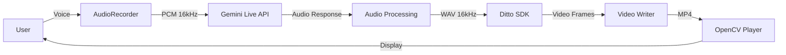
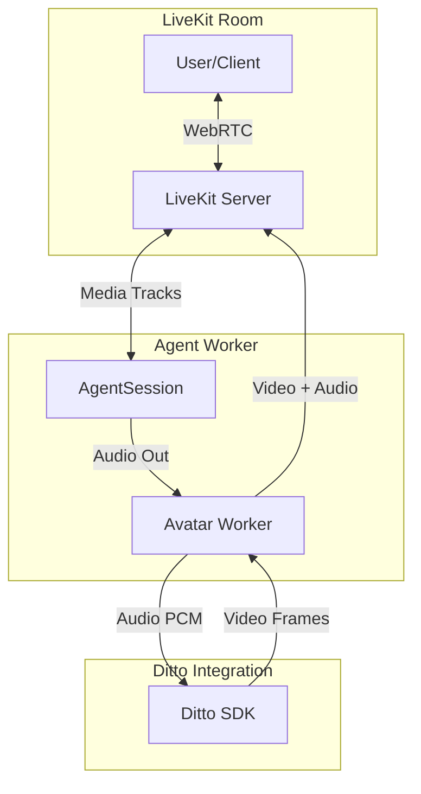

# Analysis: Features for Creating a Virtual Avatar with LiveKit

## 📋 Executive Summary

This document analyzes the **Ditto TalkingHead** project and identifies the key features needed to create a **Virtual Avatar** using the **LiveKit Agents Framework**. The current project uses the Ditto model for real-time talking head synthesis, integrated with Gemini AI, but is **not currently using LiveKit**.

---

## 🎯 Current Project: Ditto TalkingHead

### Overview
- **Model**: Ditto - Motion-Space Diffusion for Controllable Realtime Talking Head Synthesis
- **Version**: 0.4.0
- **Technology**: PyTorch + TensorRT for optimized inference
- **Python**: 3.10
- **GPU**: Optimized for NVIDIA A100 (CUDA 12.1+)

### Current Architecture



### Main Components

#### 1. **Audio Pipeline** (`gemini_realtime.py`)
- `GeminiLiveClient`: Client for real-time conversations with Gemini
- `AudioRecorder`: Microphone audio capture (16kHz, mono, PCM16)
- `AudioPlayer`: Audio playback (24kHz)
- Resampling and WAV conversion functions

#### 2. **Video Pipeline** (`stream_pipeline_online.py`, `stream_pipeline_offline.py`)
- `StreamSDK`: Main SDK for video generation
- **Parallel Workers**:
  - `audio2motion_worker`: Converts audio to facial movements
  - `motion_stitch_worker`: Combines movements
  - `warp_f3d_worker`: 3D warping
  - `decode_f3d_worker`: Frame decoding
  - `writer_worker`: Video writing

#### 3. **Core Models** (`core/models/`)
- `appearance_extractor`: Extracts appearance features
- `motion_extractor`: Extracts motion features
- `lmdm`: Latent Motion Diffusion Model
- `decoder`: Decodes final frames
- `stitch_network`: Stitching network
- `warp_network`: Warping network

#### 4. **Real-time Session** (`realtime_avatar.py`)
```python
class RealtimeAvatarSession:
    - Integrates Gemini AI + Ditto
    - Records user audio
    - Processes with Gemini
    - Generates video with Ditto
    - Plays synchronized output
```

---

## 🚀 Required Features for Virtual Avatar with LiveKit

### 1. **LiveKit Agents Architecture**

According to LiveKit documentation, the recommended architecture is:



### 2. **LiveKit Key Components**

#### A. **AgentSession** (Agent Core)
```python
from livekit.agents.voice import AgentSession, Agent

session = AgentSession(
    llm=openai.realtime.RealtimeModel(),  # or Gemini
    vad=silero.VAD.load(),
    stt=deepgram.STT(),  # Speech-to-Text
    tts=elevenlabs.TTS()  # Text-to-Speech
)
```

**Features**:
- Manages agent lifecycle
- Handles VAD (Voice Activity Detection)
- Coordinates STT, LLM, TTS
- Publishes/subscribes to audio/video tracks

#### B. **AvatarSession** (Avatar Worker)
```python
from livekit.plugins import hedra, simli, tavus

avatar_session = hedra.AvatarSession(
    avatar_participant_identity="ditto-avatar",
    avatar_image=Image.open("avatar.png"),
)

await avatar_session.start(session, room=ctx.room)
```

**Features**:
- Creates a **separate participant** in the room
- Receives audio from `AgentSession`
- Generates synchronized video
- Publishes video + audio tracks to the room

#### C. **Custom Plugin for Ditto**

You need to create a plugin similar to existing ones (Hedra, Simli, Tavus):

```python
# livekit-plugins-ditto/livekit/plugins/ditto/avatar.py

from livekit.agents import Plugin
from livekit.plugins.ditto import DittoAvatarSession

class DittoPlugin(Plugin):
    def __init__(self):
        super().__init__()
        
class DittoAvatarSession:
    def __init__(
        self,
        avatar_participant_identity: str,
        source_image: str,
        data_root: str = "./checkpoints/ditto_pytorch",
        cfg_pkl: str = "./checkpoints/ditto_cfg/v0.4_hubert_cfg_pytorch.pkl",
    ):
        self.sdk = StreamSDK(cfg_pkl, data_root)
        # ... initialization
        
    async def start(self, agent_session, room):
        # Create avatar participant
        # Subscribe to agent audio
        # Generate video frames
        # Publish video track
        pass
```

### 3. **Real-time Audio Integration**

#### Audio Flow: Current vs LiveKit

**Current (Gemini + Ditto)**:
```
User → Microphone → Gemini API → Audio Response → Ditto → Video
```

**With LiveKit**:
```
User → WebRTC → LiveKit Room → AgentSession → Avatar Worker → Video Track
                                      ↓
                                    LLM (Gemini/OpenAI)
                                      ↓
                                    TTS → Audio
```

#### Required Implementation

```python
class DittoAvatarWorker:
    async def _audio_stream_handler(self):
        """Process agent audio in real-time"""
        async for audio_frame in self.agent_audio_stream:
            # Convert LiveKit AudioFrame to Ditto format
            audio_data = self._convert_audio_frame(audio_frame)
            
            # Process with Ditto SDK
            video_frame = await self._generate_video_frame(audio_data)
            
            # Publish video frame to LiveKit
            await self._publish_video_frame(video_frame)
```

### 4. **Video Frame Management**

#### LiveKit Video Features

```python
from livekit import rtc

# Create video source
video_source = rtc.VideoSource(
    width=512,
    height=512,
    fps=25  # Ditto generates at 25 fps
)

# Publish track
video_track = rtc.LocalVideoTrack.create_video_track(
    "ditto-avatar-video",
    video_source
)

await room.local_participant.publish_track(video_track)
```

#### Frame Pipeline

```python
async def _video_generation_loop(self):
    """Main video generation loop"""
    while self.is_running:
        # Get audio chunk from agent
        audio_chunk = await self.audio_queue.get()
        
        # Generate frames with Ditto
        frames = self.sdk.run_chunk(audio_chunk)
        
        # Publish each frame
        for frame in frames:
            # Convert numpy array to VideoFrame
            video_frame = rtc.VideoFrame(
                width=512,
                height=512,
                type=rtc.VideoBufferType.RGBA,
                data=frame.tobytes()
            )
            
            # Capture frame to video source
            await self.video_source.capture_frame(video_frame)
```

### 5. **Audio-Video Synchronization**

> [!IMPORTANT]
> Synchronization is critical for user experience

#### Synchronization Strategies

**A. Audio Buffer**
```python
class AudioVideoSync:
    def __init__(self, buffer_ms=100):
        self.audio_buffer = queue.Queue()
        self.video_buffer = queue.Queue()
        self.buffer_duration = buffer_ms
        
    async def sync_streams(self):
        """Synchronize audio and video with buffer"""
        while True:
            # Wait for sufficient buffer
            if self.audio_buffer.qsize() >= self.min_buffer_size:
                audio = self.audio_buffer.get()
                video = await self.generate_video(audio)
                await self.publish_synced(audio, video)
```

**B. Timestamps**
```python
# Use LiveKit timestamps for synchronization
audio_frame.timestamp_us  # Microseconds
video_frame.timestamp_us  # Must match audio
```

### 6. **VAD (Voice Activity Detection)**

```python
from livekit.plugins import silero

# Configure VAD to detect when user speaks
vad = silero.VAD.load(
    min_speech_duration=0.1,  # 100ms minimum
    min_silence_duration=0.5,  # 500ms to consider end
)

session = AgentSession(
    vad=vad,
    # ... other components
)
```

**Avatar Integration**:
- When VAD detects user silence → Agent can speak
- During agent speech → Avatar animates
- During silence → Avatar in idle state

### 7. **Avatar State Management**

```python
class AvatarState(Enum):
    IDLE = "idle"           # Avatar at rest
    LISTENING = "listening" # User speaking
    THINKING = "thinking"   # Processing response
    SPEAKING = "speaking"   # Avatar speaking

class DittoAvatarSession:
    def __init__(self):
        self.state = AvatarState.IDLE
        
    async def on_user_speech_start(self):
        self.state = AvatarState.LISTENING
        # Show listening animation
        
    async def on_agent_speech_start(self):
        self.state = AvatarState.SPEAKING
        # Start video generation
```

---

## 🔧 Proposed Implementation

### Plugin Structure

```
livekit-plugins-ditto/
├── livekit/
│   └── plugins/
│       └── ditto/
│           ├── __init__.py
│           ├── avatar.py          # Main AvatarSession
│           ├── video_source.py    # Video source management
│           ├── audio_processor.py # Audio processing
│           └── ditto_sdk.py       # Ditto SDK wrapper
├── pyproject.toml
└── README.md
```

### Plugin Base Code

```python
# livekit/plugins/ditto/avatar.py

from livekit import rtc
from livekit.agents import Plugin, utils
from typing import Optional
import asyncio
import numpy as np

class DittoAvatarSession:
    def __init__(
        self,
        avatar_participant_identity: str = "ditto-avatar",
        source_image: str = None,
        data_root: str = "./checkpoints/ditto_pytorch",
        cfg_pkl: str = "./checkpoints/ditto_cfg/v0.4_hubert_cfg_pytorch.pkl",
    ):
        self._identity = avatar_participant_identity
        self._source_image = source_image
        self._data_root = data_root
        self._cfg_pkl = cfg_pkl
        
        # Initialize Ditto SDK
        from stream_pipeline_online import StreamSDK
        self._sdk = StreamSDK(cfg_pkl, data_root)
        
        # State
        self._room: Optional[rtc.Room] = None
        self._video_source: Optional[rtc.VideoSource] = None
        self._audio_stream: Optional[rtc.AudioStream] = None
        self._tasks: list[asyncio.Task] = []
        
    async def start(self, agent_session, room: rtc.Room):
        """Start avatar session"""
        self._room = room
        
        # Create video source
        self._video_source = rtc.VideoSource(
            width=512,
            height=512,
            fps=25
        )
        
        # Publish video track
        video_track = rtc.LocalVideoTrack.create_video_track(
            f"{self._identity}-video",
            self._video_source
        )
        
        await room.local_participant.publish_track(
            video_track,
            rtc.TrackPublishOptions(
                source=rtc.TrackSource.SOURCE_CAMERA
            )
        )
        
        # Setup Ditto with source image
        output_path = f"./tmp/{self._identity}_output.mp4"
        self._sdk.setup(self._source_image, output_path)
        
        # Subscribe to agent audio
        self._audio_stream = agent_session.audio_output_stream()
        
        # Start processing
        self._tasks.append(
            asyncio.create_task(self._process_audio_loop())
        )
        
    async def _process_audio_loop(self):
        """Main processing loop"""
        audio_buffer = []
        
        async for audio_frame in self._audio_stream:
            # Accumulate audio
            audio_buffer.append(audio_frame.data)
            
            # Process in chunks
            if len(audio_buffer) >= 10:  # ~200ms at 16kHz
                audio_chunk = np.concatenate(audio_buffer)
                audio_buffer.clear()
                
                # Generate video frames
                await self._generate_and_publish_frames(audio_chunk)
                
    async def _generate_and_publish_frames(self, audio_chunk: np.ndarray):
        """Generate and publish video frames"""
        # Convert audio to features
        aud_feat = self._sdk.wav2feat.wav2feat(audio_chunk)
        
        # Queue for processing
        self._sdk.audio2motion_queue.put(aud_feat)
        
        # Get generated frames
        # (This requires modifying StreamSDK for individual frame access)
        frames = await self._get_generated_frames()
        
        for frame in frames:
            # Convert to LiveKit VideoFrame
            video_frame = rtc.VideoFrame(
                width=512,
                height=512,
                type=rtc.VideoBufferType.RGBA,
                data=frame.tobytes()
            )
            
            # Publish frame
            await self._video_source.capture_frame(video_frame)
            
    async def stop(self):
        """Stop session"""
        for task in self._tasks:
            task.cancel()
        
        self._sdk.close()
```

### Main Agent

```python
# agent.py

from dotenv import load_dotenv
from livekit import agents
from livekit.agents.voice import AgentSession, Agent
from livekit.plugins import openai, silero, deepgram, elevenlabs
from livekit.plugins.ditto import DittoAvatarSession
from PIL import Image

load_dotenv()

class DittoVoiceAgent(Agent):
    def __init__(self):
        super().__init__(
            instructions="""
            You are a friendly AI assistant with a visual avatar.
            Keep your responses brief and conversational.
            """
        )

async def entrypoint(ctx: agents.JobContext):
    # Load avatar image
    avatar_image = Image.open("./example/image.png")
    
    # Create avatar session
    avatar_session = DittoAvatarSession(
        avatar_participant_identity="ditto-avatar",
        source_image="./example/image.png",
        data_root="./checkpoints/ditto_pytorch",
        cfg_pkl="./checkpoints/ditto_cfg/v0.4_hubert_cfg_pytorch.pkl",
    )
    
    # Create agent session
    session = AgentSession(
        stt=deepgram.STT(model="nova-2"),
        llm=openai.LLM(model="gpt-4o"),
        tts=elevenlabs.TTS(voice="Rachel"),
        vad=silero.VAD.load(),
    )
    
    # Start avatar
    await avatar_session.start(session, room=ctx.room)
    
    # Start agent
    await session.start(
        room=ctx.room,
        agent=DittoVoiceAgent()
    )
    
    # Generate initial reply
    await session.generate_reply()

if __name__ == "__main__":
    agents.cli.run_app(
        agents.WorkerOptions(entrypoint_fnc=entrypoint)
    )
```

---

## 📊 Comparison: Current Architecture vs LiveKit

| Aspect | Current (Gemini + Ditto) | With LiveKit |
|---------|------------------------|-------------|
| **Communication** | Direct HTTP/WebSocket to Gemini | WebRTC through LiveKit Room |
| **Audio** | Local PyAudio | Audio tracks in LiveKit |
| **Video** | MP4 files + OpenCV | Real-time video tracks |
| **Synchronization** | Manual (threading) | Automatic (LiveKit) |
| **Scalability** | One user at a time | Multiple concurrent users |
| **Latency** | ~2-5 seconds | ~500ms - 1 second |
| **Deployment** | Local | Cloud (LiveKit Cloud) or self-hosted |
| **Frontend** | OpenCV window | Web/Mobile (React, Swift, Android) |

---

## 🎨 Advanced Features

### 1. **Controlled Facial Expressions**

```python
# Ditto supports emotion control
ctrl_info = {
    'emotion': 'happy',  # happy, sad, angry, neutral
    'eye_open': 0.8,     # 0-1
    'eye_ball': (0.5, 0.5)  # gaze direction
}

self._sdk.setup_Nd(
    N_d=num_frames,
    ctrl_info=ctrl_info
)
```

### 2. **Multiple Avatars**

```python
# Create multiple avatars in the same room
avatar1 = DittoAvatarSession(
    avatar_participant_identity="avatar-1",
    source_image="person1.png"
)

avatar2 = DittoAvatarSession(
    avatar_participant_identity="avatar-2",
    source_image="person2.png"
)
```

### 3. **Agent Handoffs**

```python
from livekit.agents import handoff

# Transfer conversation to another agent with different avatar
await session.handoff_to("specialist-agent")
```

### 4. **Metrics and Monitoring**

```python
class AvatarMetrics:
    def __init__(self):
        self.frame_generation_time = []
        self.audio_processing_time = []
        self.sync_offset = []
        
    async def log_metrics(self):
        avg_frame_time = np.mean(self.frame_generation_time)
        print(f"Avg frame generation: {avg_frame_time}ms")
```

---

## 🚧 Challenges and Solutions

### 1. **Generation Latency**

**Problem**: Ditto takes ~100-200ms per frame

**Solutions**:
- Frame pre-buffering
- Parallel generation with multiple workers
- Use TensorRT for optimization
- Reduce resolution (512x512 → 256x256)

### 2. **Lip Synchronization**

**Problem**: Synchronizing lip movements with audio

**Solutions**:
- Use precise LiveKit timestamps
- Adaptive compensation buffer
- Hubert model for better alignment

### 3. **GPU Consumption**

**Problem**: Ditto requires powerful GPU

**Solutions**:
- Use LiveKit Cloud with GPU workers
- Implement session pooling
- Scale horizontally with Kubernetes

### 4. **Network Quality**

**Problem**: WebRTC sensitive to network conditions

**Solutions**:
- Adaptive bitrate in video
- FEC (Forward Error Correction)
- Simulcast for multiple qualities

---

## 📦 Required Dependencies

```toml
[project.dependencies]
# LiveKit Core
livekit = "^0.17.0"
livekit-agents = "^0.12.0"
livekit-api = "^0.7.0"

# Plugins
livekit-plugins-openai = "^0.10.0"
livekit-plugins-deepgram = "^0.8.0"
livekit-plugins-elevenlabs = "^0.8.0"
livekit-plugins-silero = "^0.8.0"

# Ditto (existing)
torch = ">=2.5.1"
tensorrt = "==8.6.1"
librosa = ">=0.10.2"
opencv-python-headless = ">=4.10.0"

# Additional
numpy = "==2.0.1"
pillow = ">=11.0.0"
```

---

## 🎯 Implementation Roadmap

### Phase 1: Basic Plugin (2-3 weeks)
- [ ] Create plugin structure
- [ ] Implement basic `DittoAvatarSession`
- [ ] Integrate with `AgentSession`
- [ ] Publish video track to LiveKit Room
- [ ] Basic testing with Playground

### Phase 2: Optimization (2-3 weeks)
- [ ] Implement audio/video buffering
- [ ] Improve synchronization
- [ ] Optimize frame generation
- [ ] Reduce end-to-end latency
- [ ] Metrics and logging

### Phase 3: Advanced Features (3-4 weeks)
- [ ] Emotion control
- [ ] Multiple avatars
- [ ] Handoffs
- [ ] Frontend integration (React/Swift)
- [ ] LiveKit Cloud deployment

### Phase 4: Production (2-3 weeks)
- [ ] Exhaustive testing
- [ ] Complete documentation
- [ ] Examples and tutorials
- [ ] CI/CD pipeline
- [ ] Monitoring and alerts

---

## 📚 Additional Resources

### LiveKit Documentation
- [Agents Overview](https://docs.livekit.io/agents/)
- [Virtual Avatar Guide](https://docs.livekit.io/agents/models/avatar/)
- [Plugin Development](https://docs.livekit.io/agents/models/#contribute)
- [Python SDK Reference](https://docs.livekit.io/reference/python/)

### Reference Examples
- [Hedra Avatar Plugin](https://github.com/livekit/agents/tree/main/livekit-plugins/livekit-plugins-hedra)
- [Simli Avatar Plugin](https://github.com/livekit/agents/tree/main/livekit-plugins/livekit-plugins-simli)
- [Avatar Examples](https://github.com/livekit-examples/python-agents-examples/tree/main/complex-agents/avatars)

### Ditto
- [Ditto Paper](https://arxiv.org/abs/2411.19509)
- [Ditto GitHub](https://github.com/antgroup/ditto-talkinghead)
- [Ditto HuggingFace](https://huggingface.co/digital-avatar/ditto-talkinghead)

---

## ✅ Conclusions

### Advantages of Migrating to LiveKit

1. **Scalability**: Supports multiple concurrent users
2. **Infrastructure**: LiveKit handles WebRTC, synchronization, networking
3. **Ecosystem**: Integration with multiple LLMs, STT, TTS
4. **Frontend**: SDKs for Web, iOS, Android, Flutter
5. **Deployment**: Cloud or self-hosted with Kubernetes
6. **Monitoring**: Built-in dashboard and metrics

### Main Challenges

1. **Complexity**: Requires understanding LiveKit architecture
2. **Latency**: Optimize real-time frame generation
3. **GPU**: Efficiently manage GPU resources
4. **Testing**: Test with variable network conditions

### Recommendation

✅ **Migrating to LiveKit is highly recommended** if the goal is to:
- Create a production application
- Support multiple users
- Cloud deployment
- Integration with web/mobile frontends

The current project is excellent as a **proof of concept**, but LiveKit provides the necessary infrastructure to **scale to production**.

---

## 🔗 Next Steps

1. **Study avatar examples** in LiveKit (Hedra, Simli)
2. **Create prototype** of Ditto plugin
3. **Testing** with LiveKit Playground
4. **Optimize** latency and synchronization
5. **Document** and publish plugin

---

*Document generated on 2026-02-13*
*Based on Ditto v0.4.0 and LiveKit Agents v0.12.0*
